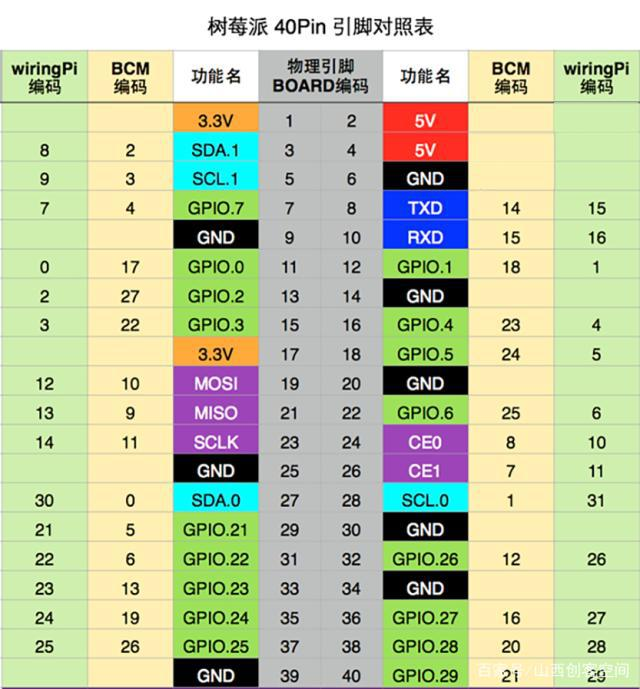
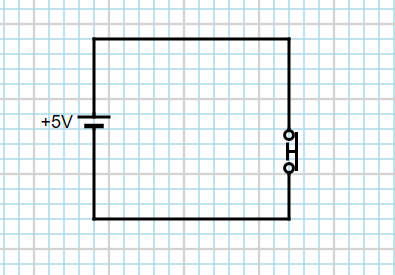
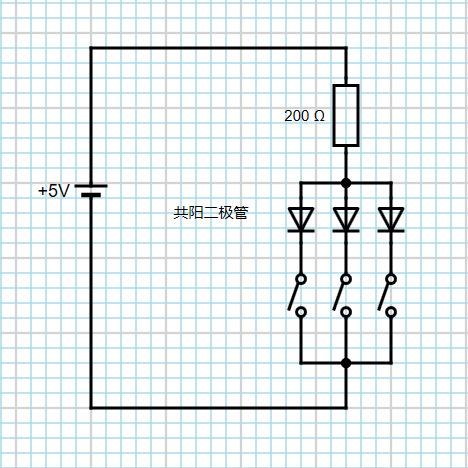
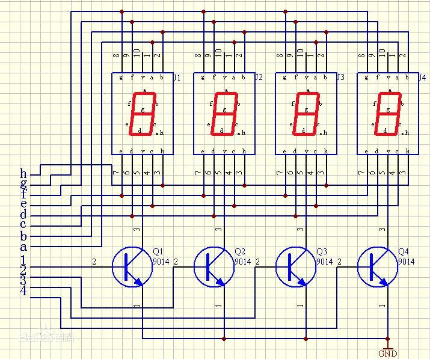
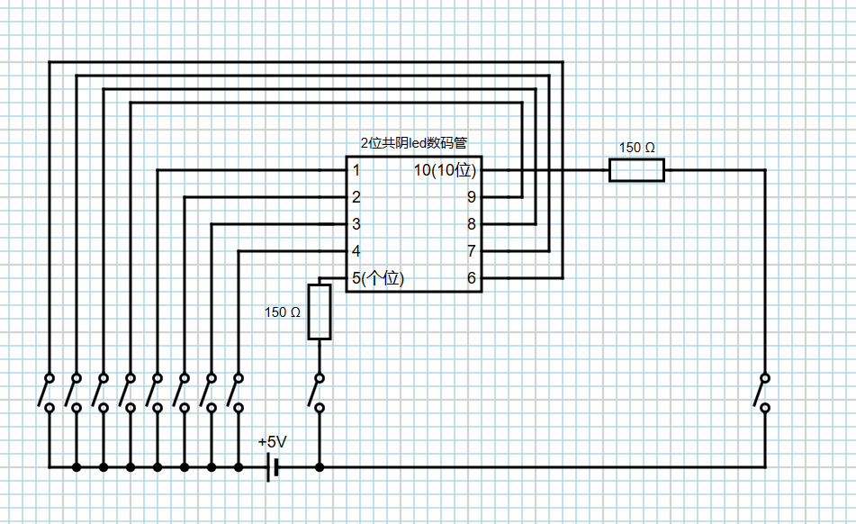

# Python


Python是Guido van Rossum 在1989年圣诞节期间，在阿姆斯特丹，为了打发时间，所开发的一个解释型语言。

##### 基础特性
* 解释型(.pyc文件) 
    * 简明易懂，注重实用
    * 跨平台
* 强类型
    * 严谨
* 动态类型
    * 对于其他语言模块的引用支持度高(胶水语言)

##### 发展状况
* [是当前仅次于Java和C的流行度排名第三的编程语言](https://www.tiobe.com/tiobe-index/)
* 2.7版本已于今年1月1日停止支持，建议安装3.7版本。

##### 语言特点
* 较少使用符号,使用缩进表示代码块
* 类的静态属性可以被实例调用
* 鸭子类型
* 同一个进程下的多线程只能使用同一个CPU核(伪多线程)

# 色环电阻
色环电阻分为五环和四环，色环标识了电阻值和误差。

通常最后两环之间距离较远。


# GPIO 
* `GPIO.setmode()`设置编码方式
  * BOARD编码
  * BCM编码



* `GPIO.setup()`设置输入输出
* `GPIO.output()`改变输出电压
* `GPIO.add_event_detect()`侦听输入电压变化情况

* 高电平 3.3V
  * GPIO.HIGH
  * 1
  * True
* 低电平 0
  * GPIO.LOW
  * 0
  * False

##### 开关

```
import RPi.GPIO as GPIO
import time

BtnPin = 33

def setup():
    GPIO.setwarnings(False)
    GPIO.setmode(GPIO.BOARD)
    GPIO.setup(BtnPin, GPIO.IN, pull_up_down=GPIO.PUD_DOWN)
    GPIO.add_event_detect(BtnPin, GPIO.RISING,
                          callback=detectChange, bouncetime=20)


def detectChange(chn):
    print("detectChange", GPIO.input(BtnPin))


def loop():
    while True:
        pass


def destroy():
    print("KeyboardInterrupt")
    GPIO.cleanup()


setup()
try:
    loop()
except KeyboardInterrupt:
    destroy()

```
##### 共阳二极管

```
import RPi.GPIO as GPIO
import time

GPIO.setwarnings(False)
pointList = (36, 37, 38, 40)

GPIO.setmode(GPIO.BOARD)
GPIO.setup(pointList, GPIO.OUT)


def changeColor(lowNum):  # 36~38
    GPIO.output(list(filter(lambda item: item != lowNum, pointList)), GPIO.HIGH)
    GPIO.output(lowNum, GPIO.LOW)


nowNum = 36
while True:
    if(nowNum == 38):
        nowNum = 36
    else:
        nowNum = nowNum+1
    changeColor(nowNum)
    time.sleep(0.5)
```
##### 2位共阴led数码管


```
import RPi.GPIO as GPIO
import time

GPIO.setwarnings(False)

hz = 250
positiveDict = {
    "ones": 5,
    "tens": 10
}

# {led point num : GPIO}
pointDict = {
    1: 12,
    2: 13,
    3: 15,
    4: 16,
    5: 7,
    6: 18,
    7: 22,
    8: 29,
    9: 31,
    10: 11
}
pointTuple = tuple(map(lambda item: pointDict[item], pointDict))

GPIO.setmode(GPIO.BOARD)
GPIO.setup(pointTuple, GPIO.OUT)

# {num:led point num}
transferDict = {
    0: (7, 6, 4, 1, 3, 8),
    1: (6, 4),
    2: (7, 6, 1, 3, 9),
    3: (7, 6, 4, 1, 9),
    4: (6, 4, 8, 9),
    5: (7, 4, 1, 8, 9),
    6: (7, 4, 1, 3, 8, 9),
    7: (7, 6, 4),
    8: (7, 6, 4, 1, 3, 8, 9),
    9: (7, 6, 4, 1, 8, 9)
}


def closeAll():
    GPIO.output(pointTuple, GPIO.LOW)
    GPIO.output(pointDict[positiveDict["ones"]], GPIO.HIGH)
    GPIO.output(pointDict[positiveDict["tens"]], GPIO.HIGH)


def showNum(targetNum):
    showSingleNum(targetNum, "ones")
    showSingleNum(targetNum, "tens")


def showSingleNum(targetNum, positive):
    closeAll()
    if(positive == "tens"):
        num = targetNum//10
    elif (positive == "ones"):
        num = targetNum % 10

    GPIO.output(pointDict[positiveDict[positive]], GPIO.LOW)
    for item in transferDict[num]:
        GPIO.output(pointDict[item], GPIO.HIGH)
    time.sleep(1/hz/2)


while True:
    for item in range(100):
        for times in range(hz):
            showNum(item)

# while True:
#    showNum(32)
```